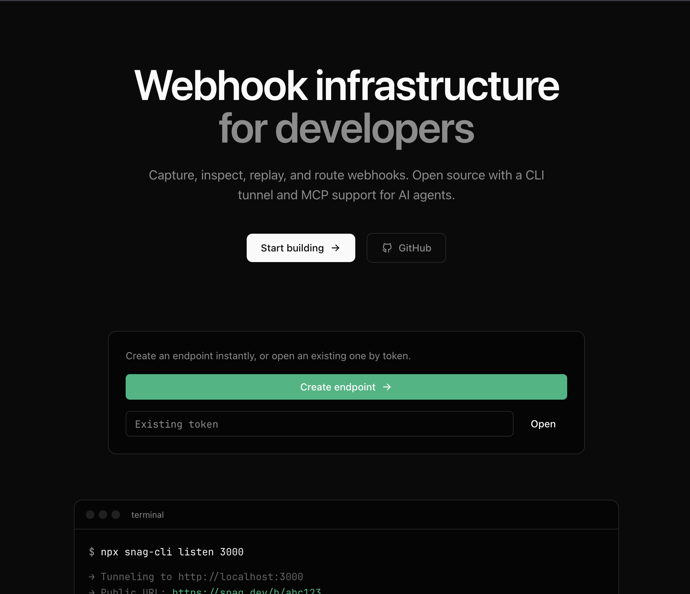
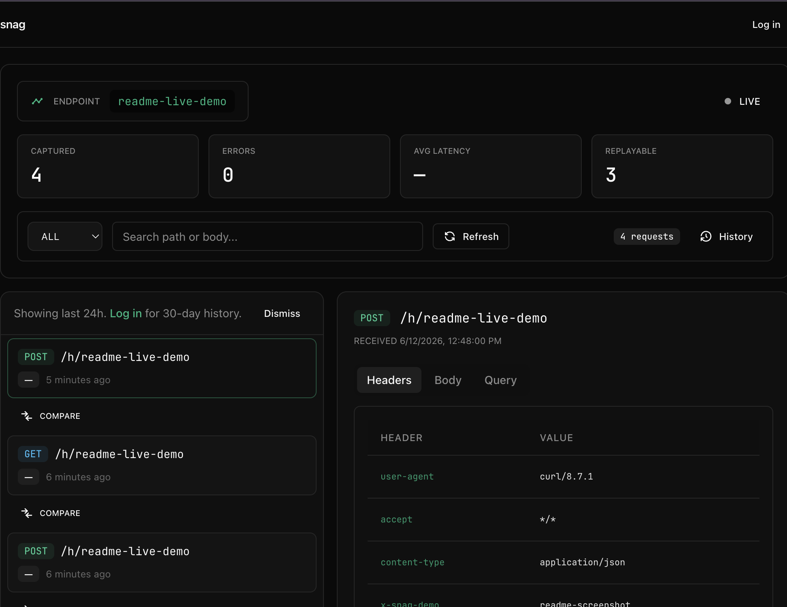
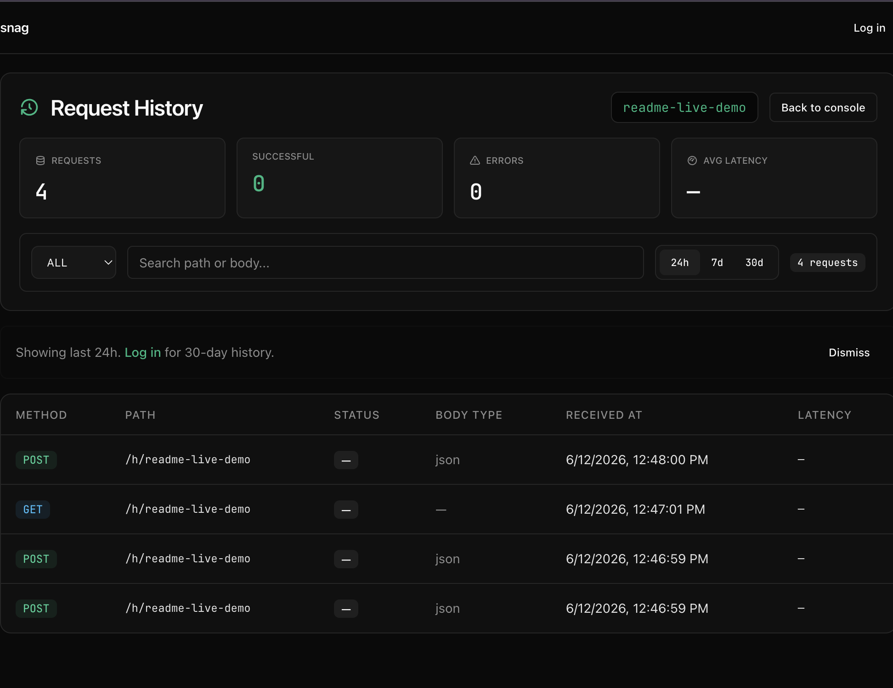
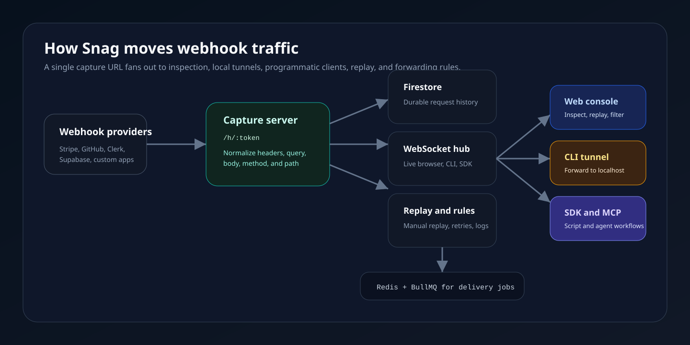

# Snag

<p align="center">
  
</p>

<p align="center">
  <strong>Open-source webhook inspection for developers who need real payloads, fast feedback, replayable bugs, local tunnels, SDK access, and agent-ready tooling.</strong>
</p>

<p align="center">
  <a href="https://github.com/munimx/Snag/actions/workflows/ci.yml"></a>
  
  
  
  
</p>

Snag gives every developer a permanent, inspectable capture URL for incoming
HTTP requests. Use it to debug provider webhooks, share repros, replay real
payloads, forward selected events, expose local handlers through the CLI tunnel,
or let AI coding agents inspect webhook traffic through MCP.

## Screenshots

These are real screenshots from the live deployment, captured on June 12, 2026.
The console and history views are backed by the public Fly.io API endpoint
`https://snag-server.fly.dev/h/readme-live-demo`.

<p align="center">
  
</p>

<p align="center">
  
</p>

## Live Deployment Smoke Test

The hosted stack is wired to real endpoints:

| Surface | URL |
| ------- | --- |
| Web console | `https://snag-web-five.vercel.app` |
| API health | `https://snag-server.fly.dev/health` |
| Capture URL | `https://snag-server.fly.dev/h/:token` |
| WebSocket hub | `wss://snag-server.fly.dev/ws` |

Verify the live API:

```bash
curl https://snag-server.fly.dev/health
```

Send a real webhook to the README demo endpoint:

```bash
curl -X POST 'https://snag-server.fly.dev/h/readme-live-demo?source=readme&provider=stripe' \
  -H 'content-type: application/json' \
  -H 'x-snag-demo: readme' \
  --data '{
    "id": "evt_readme_demo",
    "type": "checkout.session.completed",
    "data": {
      "object": {
        "id": "cs_readme_demo",
        "amount_total": 4900,
        "currency": "usd"
      }
    }
  }'
```

Inspect the captured requests:

```bash
curl 'https://snag-server.fly.dev/api/endpoints/readme-live-demo/requests?limit=5'
```

Open the live console at
`https://snag-web-five.vercel.app/console/readme-live-demo`.

## Why Developers Use Snag

| Need                                 | Snag gives you                                                                       |
| ------------------------------------ | ------------------------------------------------------------------------------------ |
| Inspect real provider traffic        | Token-based capture URLs, request history, headers, query, body, status, and latency |
| Debug local handlers                 | `snag listen <port>` streams captures and forwards traffic to `localhost:<port>`     |
| Reproduce production bugs            | Copy cURL commands or replay stored requests to any target URL                       |
| Route only the events you care about | Forwarding rules with method/body filters, retries, and delivery logs                |
| Automate webhook workflows           | TypeScript SDK for tests, scripts, browser tools, and internal platforms             |
| Give AI agents real context          | Python MCP server with endpoint, wait, inspect, replay, rule, and cleanup tools      |

## Quick Start

Run the full local stack:

```bash
docker compose up --build
```

Then open:

```text
http://localhost:3000
```

The Compose stack includes:

- Next.js web console on `http://localhost:3000`
- Fastify API, capture server, and WebSocket hub on `http://localhost:8080`
- Redis for delivery queues
- Firestore emulator for local persistence

Create a deterministic endpoint and send a test webhook:

```bash
curl -X POST http://localhost:8080/api/endpoints \
  -H 'content-type: application/json' \
  --data '{"token":"stripe-dev","label":"Stripe dev"}'

curl -X POST http://localhost:8080/h/stripe-dev \
  -H 'content-type: application/json' \
  --data '{"type":"checkout.session.completed","data":{"object":{"id":"cs_test_123"}}}'
```

Open `http://localhost:3000/console/stripe-dev` to inspect the captured request.

## CLI Tunnel

Start your local webhook handler, then open a Snag tunnel to it:

```bash
snag listen 4242 --token stripe-dev --server http://localhost:8080
```

Snag prints the public capture URL and relays captured requests to
`127.0.0.1:4242`.

```text
http://localhost:8080/h/stripe-dev -> localhost:4242
```

The CLI also supports request inspection, replay, JSON output, and login flows.
See [`docs/cli-guide.md`](docs/cli-guide.md).

## TypeScript SDK

```bash
pnpm add @snag/sdk
```

```ts
import { SnagClient } from '@snag/sdk';

const client = new SnagClient({ baseUrl: 'http://localhost:8080' });
const endpoint = client.getEndpoint('stripe-dev');

const request = await endpoint.waitForRequest({ timeout: 30_000 });
if (request) {
  console.log(request.id, request.toCurl());
}
```

See [`docs/sdk-guide.md`](docs/sdk-guide.md).

## MCP for Coding Agents

Run the MCP server with `uvx`:

```bash
SNAG_SERVER_URL=http://localhost:8080 uvx snag-mcp
```

Available tools include:

- `snag_create_endpoint`
- `snag_wait_for_request`
- `snag_list_requests`
- `snag_get_request`
- `snag_replay_request`
- `snag_create_forward_rule`
- `snag_delete_endpoint`

See [`docs/mcp-quickstart.md`](docs/mcp-quickstart.md).

## Architecture

<p align="center">
  
</p>

Snag is a monorepo with five user-facing surfaces and two shared internal
packages.

| Surface            | Package           | Runtime                    | Purpose                                                              |
| ------------------ | ----------------- | -------------------------- | -------------------------------------------------------------------- |
| Web console        | `apps/web`        | Next.js 15 + React 19      | Live feed, history, replay UI, forwarding rules, auth UX             |
| Capture/API server | `apps/server`     | Node 20 + Fastify          | Capture endpoint, REST API, WebSocket hub, replay, auth/session APIs |
| CLI tunnel         | `packages/cli`    | Node 20                    | Terminal listener, local tunnel, inspect/replay/login commands       |
| MCP server         | `packages/mcp`    | Python 3.11+ + uv          | Tool bridge for MCP-compatible coding agents                         |
| TypeScript SDK     | `packages/sdk`    | Node/browser-compatible TS | Programmatic endpoint, request, subscription, replay helpers         |
| Shared contracts   | `packages/shared` | TypeScript                 | Shared request types and WebSocket message unions                    |
| DB package         | `packages/db`     | TypeScript/Prisma package  | Internal schema/client artifacts kept in-repo                        |

## Core Capabilities

- Capture any HTTP method at `GET|POST|PUT|PATCH|DELETE|HEAD|OPTIONS /h/:token`
- Store normalized method, path, query, headers, body, body type, status, latency,
  and timestamp
- Broadcast live request events over `/ws`
- Forward captured traffic to CLI clients registered on the same token
- List, search, inspect, delete, wait for, and replay captured requests
- Create forwarding rules with optional method/body filters and delivery retries
- Issue and verify magic-link sessions for protected app workflows
- Run MCP tools with reproducible `uv.lock` installs

## Development

Install TypeScript workspace dependencies:

```bash
pnpm install
```

Set up the Python MCP package:

```bash
cd packages/mcp
uv sync
```

Run the repo:

```bash
pnpm dev
```

Run checks:

```bash
pnpm turbo typecheck lint test

cd packages/mcp
uv run ruff check .
uv run mypy snag_mcp/
uv run pytest
```

Build everything:

```bash
pnpm build
```

## Documentation

- [Self-hosting and environment setup](docs/self-hosting.md)
- [CLI workflows and tunnel examples](docs/cli-guide.md)
- [TypeScript SDK guide](docs/sdk-guide.md)
- [Provider webhook recipes](docs/recipes.md)
- [MCP quickstart](docs/mcp-quickstart.md)
- [npm package CLI README](packages/cli/README.md)

## Deployment and Release

| Target        | Platform | Workflow                                                  |
| ------------- | -------- | --------------------------------------------------------- |
| Web console   | Vercel   | `apps/web`                                                |
| API/WS server | Fly.io   | `apps/server/fly.toml` and `.github/workflows/deploy.yml` |
| CLI package   | npm      | `.github/workflows/publish.yml` tags matching `cli-v*`    |
| SDK package   | npm      | `.github/workflows/publish.yml` tags matching `sdk-v*`    |
| MCP package   | PyPI     | `.github/workflows/publish.yml` tags matching `mcp-v*`    |

## Repository Layout

```text
apps/
  web/       Next.js console
  server/    Fastify API + WS hub
packages/
  cli/       snag-cli
  mcp/       snag-mcp
  sdk/       @snag/sdk
  shared/    shared contracts
  db/        internal db package
docs/
  screenshots/
  cli-guide.md
  mcp-quickstart.md
  recipes.md
  sdk-guide.md
  self-hosting.md
```
