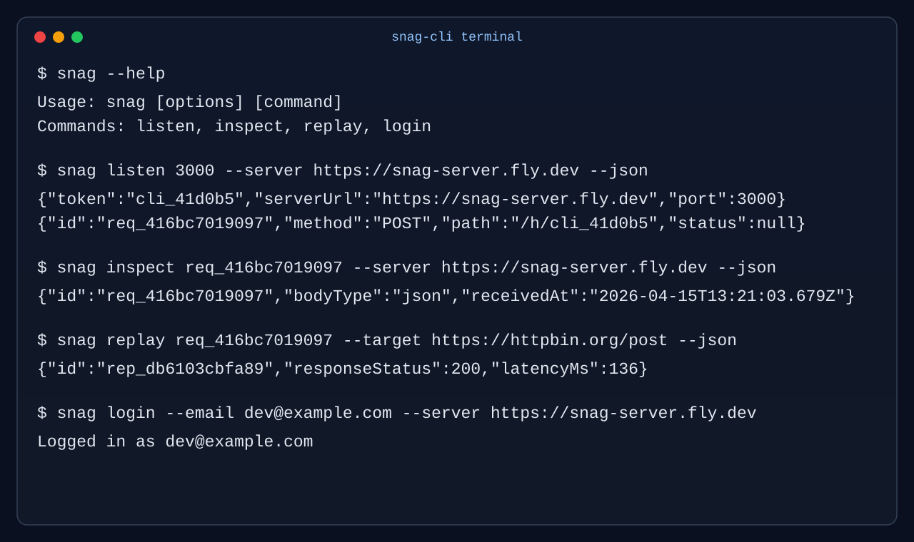
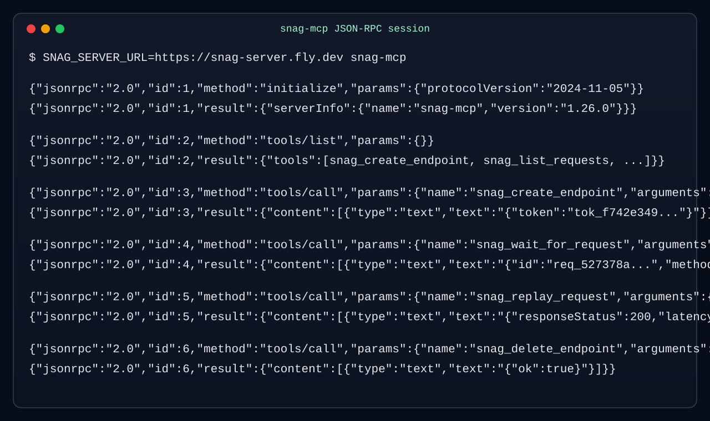

# Snag — Open-Source Webhook Inspector Platform

Snag is a multi-surface webhook platform: capture inbound HTTP traffic in real time, inspect and replay requests, route events with forwarding rules, expose local services through a CLI tunnel, and let AI agents operate the system through MCP tools.

## Product surfaces

| Surface               | Package                      | Runtime                     | What it does                                                            |
| --------------------- | ---------------------------- | --------------------------- | ----------------------------------------------------------------------- |
| Web console           | `apps/web`                   | Next.js 15 + React 19       | Live feed, history, replay UI, rule management, auth UX                 |
| Capture/API server    | `apps/server`                | Fastify + WebSocket         | Capture endpoint, REST API, WS hub, replay execution, auth/session APIs |
| CLI tunnel            | `packages/cli` (`snag-cli`)  | Node.js                     | Terminal listener + WebSocket tunnel + inspect/replay/login commands    |
| MCP server            | `packages/mcp` (`snag-mcp`)  | Python 3.11+                | Tool bridge for agent clients (Copilot, Claude Code, Cursor, etc.)      |
| TypeScript SDK        | `packages/sdk` (`@snag/sdk`) | Node + browser-friendly API | Programmatic endpoint management, request streaming, replay helpers     |
| Shared contracts      | `packages/shared`            | TypeScript                  | Shared request types and WS message unions                              |
| DB package (internal) | `packages/db`                | Prisma package              | Internal schema/client artifacts kept in-repo                           |

## Component architecture

```text
External webhook sender
  -> /h/:token (apps/server)
  -> persisted request (Firestore)
  -> broadcast event (WebSocket hub)
      -> apps/web live console
      -> snag-cli listener -> localhost:<port>
      -> @snag/sdk subscriptions
  -> replay/rules APIs
      -> web UI / CLI / MCP / SDK clients
```

## CLI screenshot



## MCP screenshot



## Key backend capabilities

- Token-based webhook capture endpoint: `POST|GET|PUT|PATCH|DELETE /h/:token`
- Request APIs: list/get/delete/replay/wait
- Forwarding rule APIs: create/list/update/toggle/delete
- Auth APIs: magic-link issue/verify, session introspection, logout
- Real-time WS endpoint: `/ws`

## Runtime and storage

- **Primary persistence:** Firebase Firestore (via Admin SDK in `apps/server`)
- **Queue/cache:** Redis (`bullmq` + `ioredis`) for delivery worker flows
- **Security defaults:** request rate limiting, 1 MB body limit, protected replay headers

## Run locally with Docker

```bash
docker compose up --build
```

Then open `http://localhost:3000`. The Compose stack includes the web console,
Fastify API/WS server, Redis, and a local Firestore emulator.

## Deployment model

| Target         | Platform     | Source                                                  |
| -------------- | ------------ | ------------------------------------------------------- |
| Web console    | Vercel       | `apps/web`                                              |
| API/WS server  | Fly.io       | `apps/server/fly.toml` + `.github/workflows/deploy.yml` |
| npm packages   | npm registry | `.github/workflows/publish.yml` (`cli-v*`, `sdk-v*`)    |
| Python package | PyPI         | `.github/workflows/publish.yml` (`mcp-v*`)              |

## Repository layout

```text
apps/
  web/       Next.js console
  server/    Fastify API + WS hub
packages/
  cli/       snag-cli
  mcp/       snag-mcp (Python)
  sdk/       @snag/sdk
  shared/    shared contracts
  db/        internal db package
docs/
  self-hosting.md
  mcp-quickstart.md
  cli-guide.md
  sdk-guide.md
  recipes.md
```

## Documentation map

- Self-hosting and env setup: [`docs/self-hosting.md`](docs/self-hosting.md)
- CLI workflows and tunnel examples: [`docs/cli-guide.md`](docs/cli-guide.md)
- TypeScript SDK usage: [`docs/sdk-guide.md`](docs/sdk-guide.md)
- Provider webhook recipes: [`docs/recipes.md`](docs/recipes.md)
- MCP setup notes: [`docs/mcp-quickstart.md`](docs/mcp-quickstart.md)
- npm package CLI README: [`packages/cli/README.md`](packages/cli/README.md)

## Monorepo scripts

```bash
pnpm dev
pnpm build
pnpm lint
pnpm typecheck
pnpm test
```
